# SQL-Challenge-Danny-Ma-Week-1

--------------------------------------------------------------------------------------------------------------------------------------------------------------------------------

*This repository hosts my solutions to the 1st challenge (Week 1) of the 8 Weeks SQL Challenge by DannyMa. [Click here to view the full challenge](https://8weeksqlchallenge.com/case-study-1/)*

----------------------------------------------------------------------------------------------------------------------------------------------------------------------------------

## 🗒️Table of Content
* [Business Case](https://github.com/Edidiong-Udoh/SQL-Challenge-Danny-Ma-Week-1/tree/main)
* [Entity Relationship Diagram](https://github.com/Edidiong-Udoh/SQL-Challenge-Danny-Ma-Week-1/tree/main)
* [Available Data](https://github.com/Edidiong-Udoh/SQL-Challenge-Danny-Ma-Week-1/tree/main)
* [Case Study Solutions](https://github.com/Edidiong-Udoh/SQL-Challenge-Danny-Ma-Week-1/tree/main)

------------------------------------------------------------------------------------------------------------------------------------------------------------

## Business Case
Danny seriously loves Japanese food so in the beginning of 2021, he decides to embark upon a risky venture and opens up a cute little restaurant that sells his 3 favourite foods: sushi, curry and ramen.

Danny’s Diner is in need of your assistance to help the restaurant stay afloat - the restaurant has captured some very basic data from their few months of operation but have no idea how to use their data to help them run the business.

Danny wants to use the data to answer a few simple questions about his customers, especially about their visiting patterns, how much money they’ve spent and also which menu items are their favourite. Having this deeper connection with his customers will help him deliver a better and more personalised experience for his loyal customers.

He plans on using these insights to help him decide whether he should expand the existing customer loyalty program - additionally he needs help to generate some basic datasets so his team can easily inspect the data without needing to use SQL.

--------------------------------------------------------------------------------------------------------------------------------------------------------------------

## Entity Relationship Diagram

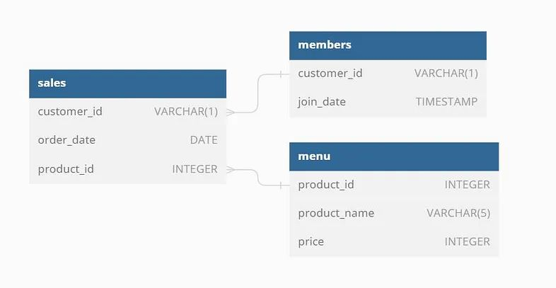

-------------------------------------------------------------------------------------------------------------------------------------------------------------------------

## Available Data

 

Dataset Used for the Challenge

 

## Introduction
This project contains the SQL query functions I used in solving the problem statements attached to this case study. It was fun and challenging at the same time. I love SQL because of its versatility. There are many ways to solve a problem and I applied my understanding of certain SQL functions in arriving at my answers.

## Case Study
Danny seriously loves Japanese food so in the beginning of 2021, he decides to embark upon a risky venture and opens up a cute little restaurant that sells his 3 favourite foods: sushi, curry and ramen.

Danny’s Diner is in need of your assistance to help the restaurant stay afloat - the restaurant has captured some very basic data from their few months of operation but have no idea how to use their data to help them run the business.

Danny wants to use the data to answer a few simple questions about his customers, especially about their visiting patterns, how much money they’ve spent and also which menu items are their favourite. Having this deeper connection with his customers will help him deliver a better and more personalised experience for his loyal customers.

He plans on using these insights to help him decide whether he should expand the existing customer loyalty program - additionally he needs help to generate some basic datasets so his team can easily inspect the data without needing to use SQL.

## Dataset
Danny shared 3 key datsets for this case:
* sales: The sales table captures all customer_id level purchases with a corresponding order_date and product_id information for when and what menu items were ordered.
* menu: The menu table maps the product_id to the actual product_name and price of each menu item.
* members: The final members table captures the join_date when a customer_id joined the beta version of the Danny’s Diner loyalty program. 

     

## Case Questions
1. What is the total amount each customer spent at the restaurant?
2. How many days has each customer visited the restaurant?
3. What was the first item from the menu purchased by each customer?
4. What is the most purchased item on the menu and how many times was it purchased by all customers?
5. Which item was the most popular for each customer?
6. Which item was purchased first by the customer after they became a member?
7. Which item was purchased just before the customer became a member?
8. What is the total items and amount spent for each member before they became a member?
9. If each $1 spent equates to 10 points and sushi has a 2x points multiplier - how many points would each customer have?
10. In the first week after a customer joins the program (including their join date) they earn 2x points on all items, not just sushi - how many points do customer A and B have at the end of January?

## Solution
**1. What is the total amount each customer spent at the restaurant?**
      
      SELECT customer_id, sum(price) as Amount_Spent
      FROM sales s
      INNER JOIN menu m
      ON s.product_id = m.product_id
      GROUP BY customer_id

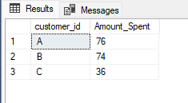

**2. How many days has each customer visited the restaurant?**

      SELECT customer_id, count (distinct(order_date)) as Days_visited
      FROM sales
      GROUP BY customer_id

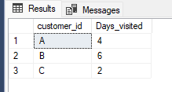

**3. What was the first item from the menu purchased by each customer?**

      WITH cte_first_date AS (
      SELECT customer_id, product_name, order_date,
      RANK() OVER(PARTITION BY customer_id ORDER BY order_date) AS rank
      FROM sales
      INNER JOIN menu
      ON sales.product_id = menu.product_id
       )

      SELECT DISTINCT customer_id, product_name, order_date
      FROM cte_first_date
      WHERE rank = 1

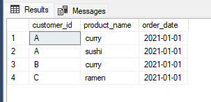

**4. What is the most purchased item on the menu and how many times was it purchased by all customers?**

     WITH Most_purchased AS (SELECT product_name, COUNT (product_name) as No_of_times_purchased
     FROM Sales s
     INNER JOIN menu m
     ON s.product_id = m.product_id
     GROUP BY product_name)

     SELECT product_name, No_of_times_purchased
     FROM Most_purchased
     WHERE No_of_times_purchased = (
     SELECT MAX(No_of_times_purchased)
     FROM Most_purchased
     );

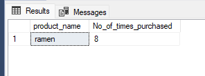

**5. Which item was the most popular for each customer?**
 

    WITH Most_Popular AS (
    SELECT customer_id, product_name, COUNT (product_name)as Times_Purchased
    FROM Sales s
    INNER JOIN Menu m
    ON s.product_id = m.product_id
    GROUP BY customer_id, product_name
    )
    SELECT customer_id, product_name, Times_Purchased
    FROM ( 
	SELECT *, RANK() OVER (PARTITION BY customer_id ORDER BY Times_Purchased DESC) as Popularity_Rank
	FROM Most_Popular
    ) subquery
    WHERE Popularity_Rank = 1;

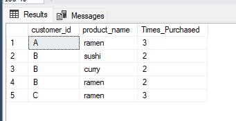

**6. Which item was purchased first by the customer after they became a member?**

    WITH date_joined AS (SELECT s.customer_id, s.product_id, m.join_date
    FROM members m
    INNER JOIN sales s
    ON m.customer_id = s.customer_id
    WHERE join_date = order_date 
    OR order_date > join_date)

    SELECT customer_id, mm.product_name, join_date
    FROM ( SELECT *, RANK() OVER(PARTITION BY customer_id ORDER BY product_id) AS first_item
    FROM date_joined
    )subquery
    INNER JOIN Menu mm
    ON subquery.product_id = mm.product_id
    WHERE first_item = 1;

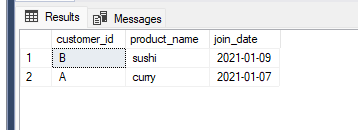

**7. Which item was purchased just before the customer became a member?**

    WITH date_joined AS (SELECT s.customer_id, s.product_id, m.join_date, s.order_date
    FROM members m
    INNER JOIN sales s
    ON m.customer_id = s.customer_id
    WHERE order_date < join_date)

    SELECT customer_id, mm.product_name, join_date, order_date
    FROM (SELECT *, DENSE_RANK() OVER(PARTITION BY customer_id ORDER BY order_date DESC) as R_N
    FROM date_joined
    )subquery
    INNER JOIN Menu mm
    ON subquery.product_id = mm.product_id
    WHERE R_N = 1;

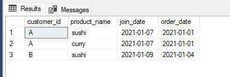

**8. What is the total items and amount spent for each member before they became a member?**

    WITH first_table AS (SELECT m.product_name, s.customer_id, s.product_id, s.order_date, mm.join_date,m.price
    FROM Sales s
    INNER JOIN Menu m
    ON s.product_id = m.product_id
    INNER JOIN Members mm
    ON s.customer_id = mm.customer_id
    WHERE order_date < join_date)

    SELECT customer_id, count (product_id) as total_items, sum(price) as amount_spent
    FROM first_table
    GROUP BY customer_id

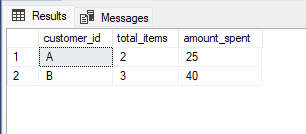

**9. If each $1 spent equates to 10 points and sushi has a 2x points multiplier - how many points would each customer have?**

    WITH cte_spent AS (SELECT customer_id, product_name, sum(price) as amount_spent
    FROM Sales s
    INNER JOIN Menu m
    ON s.product_id = m.product_id
    GROUP BY customer_id, product_name)

    SELECT 
	customer_id, 
	SUM(CASE 
			WHEN product_name = 'sushi' THEN amount_spent * 20
		ELSE amount_spent * 10
		END) as points
    FROM cte_spent
    GROUP BY customer_id; 

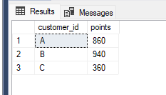

**10. In the first week after a customer joins the program (including their join date) they earn 2x points on all items, not just sushi - how many points do customer A and B have at the end of January?**

    WITH Jan_record AS (SELECT s.customer_id, product_name, order_date, join_date, sum(price) as price
    FROM Sales s
    INNER JOIN Members mm
    ON s.customer_id = mm.customer_id
    INNER JOIN Menu m
    ON s.product_id = m.product_id
    GROUP BY s.customer_id, m.product_name, s.order_date, mm.join_date)

    SELECT customer_id,
    SUM(CASE
	WHEN product_name = 'sushi' THEN price * 20
	WHEN order_date < join_date THEN price * 10
	WHEN order_date = join_date THEN price * 20
	WHEN order_date < '2021-01-31' THEN price * 20
	END) as points
    FROM Jan_record
    GROUP BY customer_id

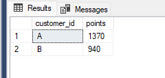

